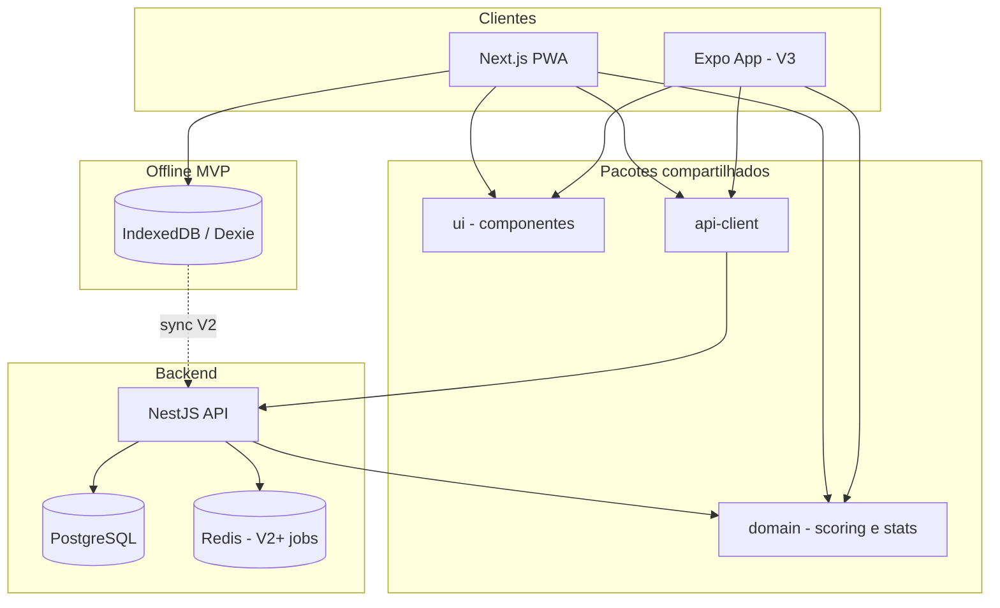

Com base na documentação completa — visão, MVP e roadmap — segue uma proposta de arquitetura técnica alinhada ao produto e preparada para evoluir até a V4.

---

# Arquitetura técnica — Beach Tennis Scout

## Contexto que orienta as decisões

| Fase | Foco |
|---|---|
| **MVP** | Registrar partida ponto a ponto, placar automático, estatísticas básicas |
| **V2** | Histórico, dashboard, comparação, stats avançadas, PDF |
| **V3** | App mobile nativo, perfis, ranking, compartilhamento |
| **V4** | IA, insights, heatmaps, análise de padrões |

Implicações técnicas principais:

- **Lógica de domínio complexa** (sets, games, tie-break, super tie-break) deve ser centralizada e testável.
- **Uso em quadra** exige interface rápida, responsiva e **funcionamento offline**.
- **Roadmap separa web (MVP/V2) de mobile nativo (V3)** — a arquitetura deve permitir web primeiro sem reescrever o core na V3.
- **V2+** exige persistência, histórico e relatórios; **V3+** exige contas, perfis e sync; **V4** exige pipeline de dados para IA.

---

## 1. Estrutura de pastas

Monorepo com **Turborepo + pnpm workspaces**, separando domínio, apps e infra:

```
beach-tennis-scout/
├── apps/
│   ├── web/                    # Next.js — MVP principal (web + PWA)
│   └── mobile/                 # Expo — iniciar esqueleto na V2, produção na V3
│
├── packages/
│   ├── domain/                 # Regras de negócio puras (TypeScript)
│   │   ├── scoring/            # Placar: sets, games, tie-break, super TB
│   │   ├── points/             # Tipos de ponto (winner, erro, subtipos)
│   │   ├── stats/              # Cálculo de estatísticas
│   │   └── match/              # Entidades: Match, Player, PointEvent
│   │
│   ├── ui/                     # Design system compartilhado (React)
│   ├── api-client/             # Cliente tipado para a API (gerado ou tRPC)
│   ├── database/               # Schema Prisma + migrations
│   └── config/                 # ESLint, TypeScript, Tailwind compartilhados
│
├── services/
│   └── api/                    # Backend NestJS ou Fastify
│
├── docs/                       # Documentação (migrar 01-Visao, 02-Requisitos, 03-Roadmap)
│
├── infra/                      # Docker, CI/CD, variáveis de ambiente
│
├── turbo.json
├── pnpm-workspace.yaml
└── package.json
```

### Responsabilidade de cada camada

| Pasta | Responsabilidade |
|---|---|
| `packages/domain` | **Coração do sistema** — scoring, stats, validações. Zero dependência de React ou banco. |
| `apps/web` | UI de scout, cadastro de partida, telas de estatísticas, PWA offline |
| `apps/mobile` | Mesma experiência nativa na V3, reutilizando `domain` e `ui` |
| `packages/database` | Schema, migrations, tipos gerados |
| `services/api` | CRUD, auth, sync, exportação PDF, jobs assíncronos (V2+) |
| `packages/ui` | Botões de scout, placar, seletores de winner/erro — otimizados para toque |

### Por que monorepo?

- Evita duplicar a lógica de placar entre web, mobile e backend.
- Facilita testes unitários do domínio (crítico para tie-break e super tie-break).
- Permite evoluir MVP → V4 sem reescrita estrutural.

---

## 2. Banco de dados

### MVP (V1): local-first + sync opcional

No MVP, **não há auth nem histórico** no roadmap. Estratégia:

1. **IndexedDB** (via Dexie.js) no browser/PWA para partidas em andamento e concluídas.
2. **PostgreSQL** no backend como destino de sync quando o usuário estiver online (prepara V2 sem mudar o modelo).

### Modelo relacional (PostgreSQL)

```
users                 -- V3: perfis, academias
organizations         -- V3: academias / torneios
players               -- V2+: cadastro persistente (MVP: nomes inline na partida)
matches
  ├── id, type (singles|doubles), status, rules_config
  ├── player references (A, B ou A1/A2/B1/B2)
  └── started_at, finished_at

sets
  ├── match_id, set_number, is_super_tiebreak
  └── games_a, games_b, tiebreak_score_a/b

games
  ├── set_id, game_number
  └── points_a, points_b (0, 15, 30, 40, AD)

point_events          -- event sourcing leve
  ├── match_id, set_id, game_id
  ├── winner_side (A|B)
  ├── event_type (winner|error)
  ├── event_subtype (direita, ace, dupla_falta, ...)
  ├── server_side, is_first_serve
  └── created_at, sequence_number

match_stats           -- materialized / calculado (V2 cache)
  ├── match_id, player_id
  └── totals, percentages (winners, erros, % saque)
```

### Princípios de modelagem

- **`point_events` como fonte da verdade** — stats derivadas, não armazenadas manualmente (permite recalcular e alimentar IA na V4).
- **Regras configuráveis** em `matches.rules_config` (JSON) para futuras variações de torneio.
- **V2**: índices em `match_id`, `player_id`, `created_at` para histórico e dashboard.
- **V4**: `point_events` vira base para features de ML (padrões, heatmap por subtipo e lado).

### Tecnologia de persistência

| Camada | Tecnologia |
|---|---|
| Servidor | **PostgreSQL** (via Supabase ou RDS) |
| ORM | **Prisma** |
| Cliente offline | **Dexie.js** (IndexedDB) |
| Sync | Fila local → API REST na V2 (`pending_sync` flag) |

---

## 3. Frontend

### MVP: Web responsiva + PWA

**Next.js 15 (App Router)** como app principal:

| Tela | Função |
|---|---|
| `/` | Home — nova partida ou retomar em andamento |
| `/match/new` | Cadastro: simples/duplas, nomes, regras padrão |
| `/match/[id]/scout` | **Tela principal** — registro ponto a ponto, placar grande, botões winner/erro |
| `/match/[id]/stats` | Estatísticas em tempo real |
| `/match/[id]/report` | Relatório pós-jogo |

### UX crítica para scout em quadra

- Placar sempre visível (sticky header).
- Botões grandes para winner/erro (mínimo 48px touch target).
- Fluxo em 2 toques: **quem ganhou** → **como foi o ponto**.
- **Undo** do último ponto (essencial em quadra).
- Modo escuro / alto contraste para sol forte.
- **Offline-first**: partida continua sem internet; sync quando voltar online.

### Stack frontend

| Camada | Escolha |
|---|---|
| Framework | Next.js 15 |
| UI | React 19 + Tailwind CSS |
| Componentes | shadcn/ui (customizável) |
| Estado local (scout) | Zustand (leve, ideal para placar em tempo real) |
| Estado servidor | TanStack Query |
| PWA / offline | next-pwa ou Serwist + Dexie |
| Formulários | React Hook Form + Zod (validação alinhada ao `domain`) |

### Pacote `packages/ui`

Componentes reutilizáveis entre web e mobile (V3):

- `Scoreboard`
- `PointRecorder` (grid winner/erro)
- `PlayerSelector`
- `MatchSummary`
- `StatCard`

---

## 4. Backend

### MVP: API mínima (ou apenas local)

Para o MVP estrito da documentação, o backend pode ser **opcional** — tudo roda no browser com IndexedDB. Porém, para não refatorar na V2, recomendo já ter a API esqueleto desde o início.

### Serviço API (`services/api`)

**NestJS** (ou Fastify se preferir menos boilerplate):

```
modules/
├── matches/        # CRUD partidas, finalizar, retomar
├── points/         # Registrar ponto, undo, listar eventos
├── stats/          # GET stats calculadas (usa packages/domain)
├── players/        # V2+
├── reports/        # V2: PDF export
├── auth/           # V3: JWT / OAuth
└── sync/           # V2: reconciliação offline → server
```

### Fluxo de registro de ponto

```
Cliente (web/mobile)
    → POST /matches/:id/points { winner, type, subtype }
        → API valida payload (Zod)
        → packages/domain: applyPoint(matchState, event)
        → Persiste point_event + atualiza snapshot de placar
        → Retorna novo estado (placar + stats parciais)
```

### Endpoints MVP

| Método | Rota | Descrição |
|---|---|---|
| POST | `/matches` | Criar partida (simples/duplas) |
| GET | `/matches/:id` | Estado atual |
| POST | `/matches/:id/points` | Registrar ponto |
| DELETE | `/matches/:id/points/last` | Desfazer último ponto |
| GET | `/matches/:id/stats` | Estatísticas (tempo real ou final) |
| PATCH | `/matches/:id/finish` | Encerrar partida |

### V2+

- Histórico paginado, dashboard agregado, comparação entre jogadores.
- Job assíncrono (BullMQ + Redis) para PDF e recálculo de stats.
- WebSocket ou SSE para sync multi-dispositivo (treinador vendo ao vivo).

---

## 5. Tecnologias recomendadas

### Stack principal

| Camada | Tecnologia | Motivo |
|---|---|---|
| Linguagem | **TypeScript** | Tipagem compartilhada em todo o monorepo |
| Monorepo | **Turborepo + pnpm** | Builds incrementais, workspaces |
| Domínio | **TypeScript puro** | Testável, compartilhado web/mobile/API |
| Web | **Next.js 15** | SSR, PWA, deploy simples (Vercel) |
| Mobile (V3) | **Expo (React Native)** | Reutiliza React, domain e UI |
| Backend | **NestJS + Fastify adapter** | Modular, escala até V4 |
| Banco | **PostgreSQL + Prisma** | Relacional, analytics, JSON para regras |
| Auth (V3) | **Supabase Auth** ou Clerk | SSO, magic link, OAuth |
| Hospedagem web | **Vercel** | Next.js nativo |
| Hospedagem API | **Railway / Fly.io / Render** | Custo baixo no início |
| CI/CD | **GitHub Actions** | Testes domain + lint + deploy |
| Testes | **Vitest** (domain) + **Playwright** (E2E scout) | Placar/tie-break precisam de cobertura |
| PDF (V2) | **@react-pdf/renderer** ou Puppeteer | Relatório pós-jogo |
| IA (V4) | **OpenAI API** + pipeline em `services/api` | Insights sobre `point_events` |

### Validação e contratos

- **Zod** — schemas compartilhados entre API e frontend.
- **tRPC** (alternativa) — se quiser end-to-end type-safe sem OpenAPI; REST + Zod também funciona bem.

---

## 6. Estratégia web e mobile

### Fase 1 — MVP (agora)

```
┌─────────────────────────────────────┐
│   Next.js PWA (apps/web)            │
│   ├── UI de scout                   │
│   ├── packages/domain (scoring)     │
│   └── Dexie (offline local)         │
└─────────────────────────────────────┘
         │ sync opcional
         ▼
┌─────────────────────────────────────┐
│   API (services/api) — esqueleto    │
│   PostgreSQL                        │
└─────────────────────────────────────┘
```

- **Web responsiva** instalável como PWA no celular (scout na quadra sem app store).
- Toda lógica de placar em `packages/domain`.
- Backend mínimo ou sync adiado; foco em UX de scout offline.

### Fase 2 — V2 (histórico e dashboard)

- Backend passa a ser **obrigatório** (histórico, comparação, PDF).
- Sync offline → online maduro.
- Dashboard web com gráficos (Recharts ou Tremor).

### Fase 3 — V3 (mobile nativo)

```
┌──────────────┐     ┌──────────────┐
│  apps/web    │     │ apps/mobile  │
│  (Next.js)   │     │  (Expo)      │
└──────┬───────┘     └──────┬───────┘
       │                    │
       └────────┬───────────┘
                ▼
       ┌─────────────────┐
       │ packages/domain │
       │ packages/ui     │
       │ packages/api-client │
       └────────┬────────┘
                ▼
       ┌─────────────────┐
       │  services/api   │
       │  + Auth + Sync  │
       └─────────────────┘
```

- **Expo** reutiliza `domain`, `ui` e `api-client`.
- Push notifications (partida compartilhada, ranking).
- Deep links para compartilhar partidas.
- App Store / Play Store.

### Fase 4 — V4 (IA)

- Pipeline ETL sobre `point_events` históricos.
- Serviço `services/insights` (ou módulo NestJS) com jobs batch.
- Heatmaps e padrões no frontend (web + mobile) consumindo endpoints de analytics.

### Resumo da estratégia

| Plataforma | Quando | Abordagem |
|---|---|---|
| **Web** | MVP | Next.js PWA — produto principal, scout offline |
| **Mobile web** | MVP | Mesmo PWA, UI touch-first |
| **Mobile nativo** | V3 | Expo, código compartilhado, sem reescrever domínio |
| **Backend** | MVP esqueleto → V2 completo | API única para web e mobile |

---

## Diagrama geral



---

## Prioridades de implementação (ordem sugerida)

1. **`packages/domain`** — motor de placar + stats (com testes para tie-break e super tie-break).
2. **`apps/web`** — fluxo scout (cadastro → registro → relatório).
3. **PWA offline** — IndexedDB + undo.
4. **`services/api` + PostgreSQL** — esqueleto para V2.
5. **`packages/ui`** — extrair componentes quando web estabilizar.
6. **`apps/mobile` (Expo)** — na V3, reutilizando tudo acima.

---

## Riscos e mitigações

| Risco | Mitigação |
|---|---|
| Duplicar lógica de placar | Tudo em `packages/domain`, testado unitariamente |
| Scout lento em quadra | UI touch-first, 2 toques por ponto, undo |
| Perda de dados offline | IndexedDB + sync queue na V2 |
| Rewrite na V3 mobile | Expo + pacotes compartilhados desde o MVP |
| Stats incorretas | Event sourcing em `point_events`, stats derivadas |

---

Esta arquitetura entrega o MVP enxuto (web PWA offline, sem depender de backend), mantém o caminho claro para histórico e dashboard na V2, mobile nativo na V3 e IA na V4 — sem reescrever o núcleo do produto.

Se quiser, no próximo passo posso detalhar apenas o **`packages/domain`** (máquina de estados do placar e cálculo de estatísticas) ou um **documento de arquitetura** formal para incluir em `docs/`.